```shell
ssh bandit[0-10]@bandit.labs.overthewire.org -p 2220 > Povezivanje sa hostom
```

## Level 0

```shell
ls -la > #ls ispisuje listu fajlova u trenutnom direktorijumu zastava -l prikazuje detaljnu listu a zastava -a prikazuje sve fajlove ukljucujuci i skrivene
cat readme > #Ispisuje sadrzaj readme fajla na ekranu
```

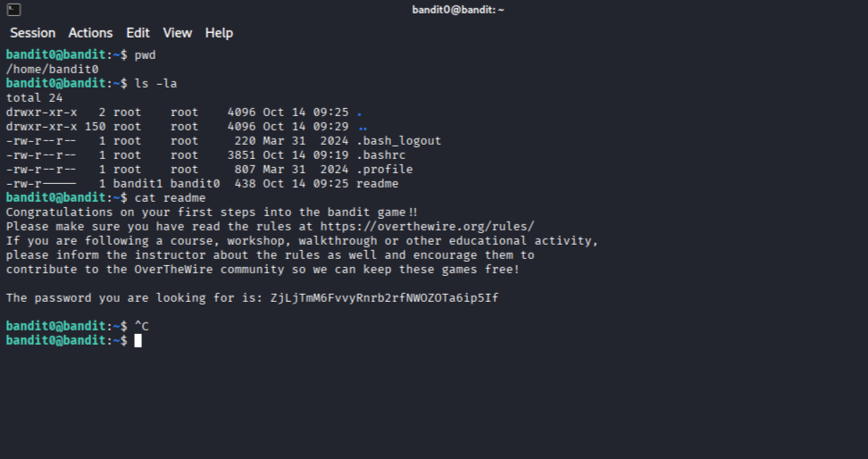

## Level 1

```shell
ls -la #Ponovo koristimo ls -la da prikazemo sve fajlove i datoteke
cat ./- #Posto je "-" standardni ulaz koristimo realativnu putanju
```

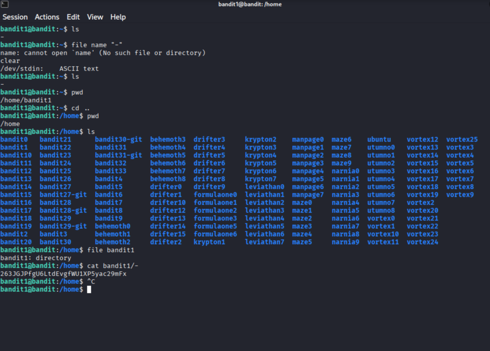

## Level 2

```shell
ls -la
cat "--spaces in this filename--" #Koristimo dvostruke navodnike ("...") da bismo shell-u ukazali da je to jedan fajl, pošto se razmak (space) standardno koristi kao separator argumenata.
cat spaces/ in /this / filename #Jos jedan nacin za resavanje
```

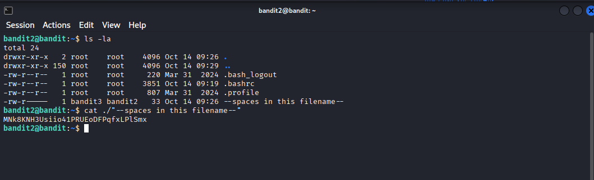

## Level 3

```shell
ls -la
cat .hidden #Ispisivanje sadrzaja na ekran
```

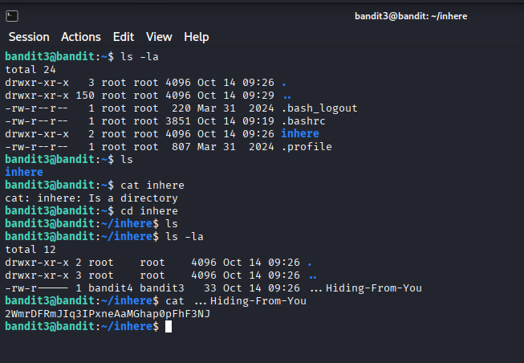

## Level 4

```shell
ls -la
file ./* #Koristimo komandu file da bismo identifikovali tipove svih datoteka u trenutnom direktorijumu.
cat ./-file07
```
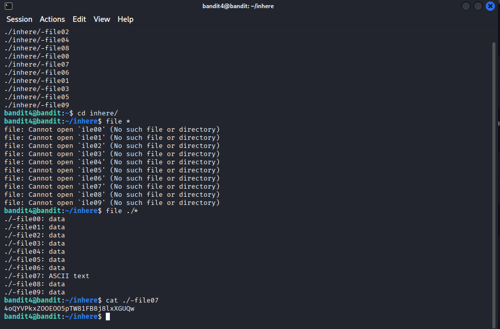

## Level 5

```shell
du -b -a | grep 1033 #Izlistavamo veličinu svih fajlova i direktorijuma u bajtovima i filtriramo rezultate, tražeći onaj koji je veličine 1033 bajta.
find . -type f -size 1033c ! -executable -exec file '{}' \; | grep ASCII #Jos jedan nacin preko comande find trazimo fajl (-type f) velicinu fajla 1033 bajta (-size 1033c) trazimo fajl koji nije executable (!- negacija) zatim izvrsavamo komandu file ('{}' ubacujemo tu putanju u fajl komandu) i nakon toga koristimo grep da izvucemo taj fajl
cat ./maybehere07/.file2 #Ispisivanje sadrzaja na ekran
```

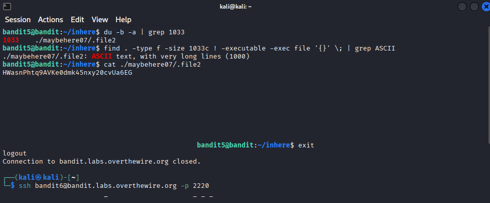

## Level 6

```shell
ls -la
find / -type f -user bandit7 -group bandit6 -size 33c 2>/dev/null #Koristimo komandu find za pretragu celog sistema. Tražimo fajl (-type f) čiji je vlasnik bandit7, a grupa bandit6, veličine 33 bajta. Koristimo 2>/dev/null za ignorisanje grešaka tokom pretrage.
```
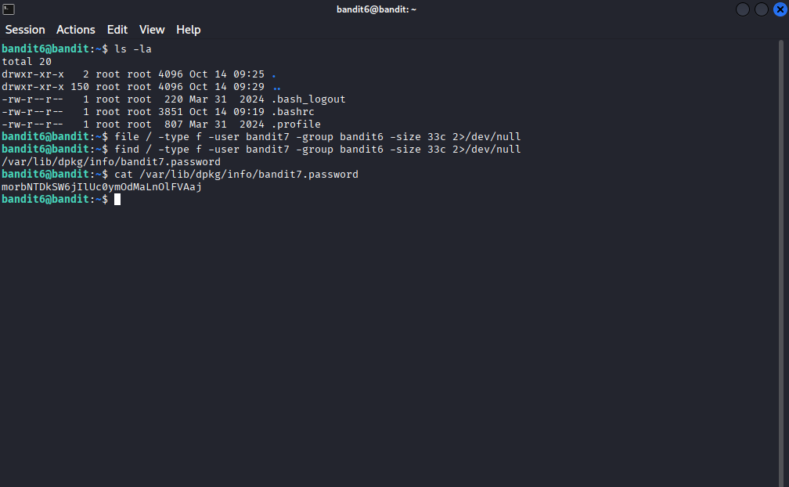

## Level 7

```shell
ls
grep "millionth" data.txt # Koristimo grep komandu da pretražimo sadržaj datoteke data.txt i izvučemo (prikažemo) liniju koja sadrži reč "millionth".
```

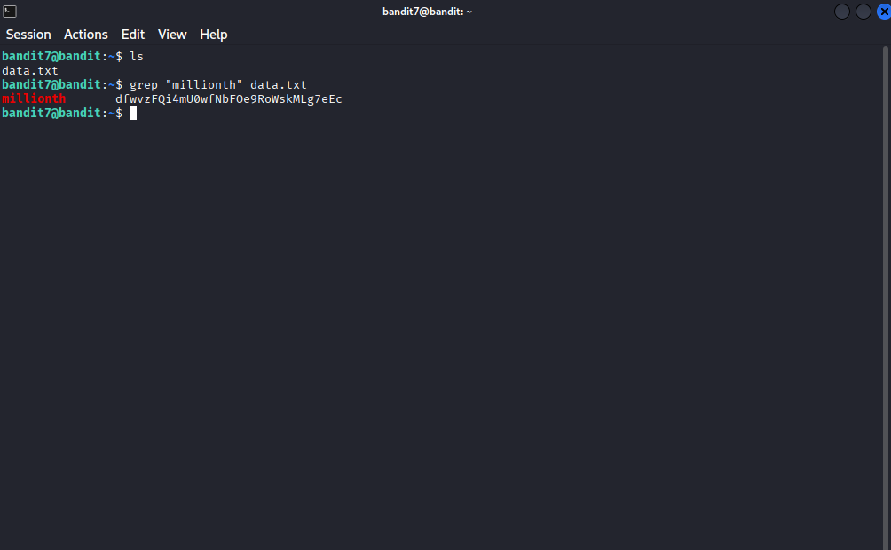

## Level 8

```shell
ls
sort data.txt | uniq -u # Prvo sortiramo data.txt fajl po abecednom redu da bi kasnije mogli da koristimo komandu uniq za pretragu jedinstvenog fajla (-u).
```

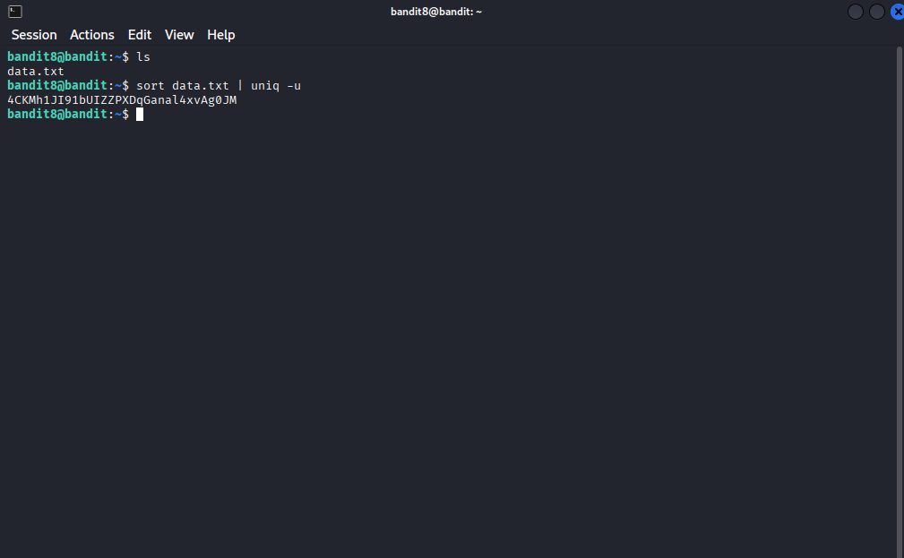

## Level 9

```shell
strings data.txt | grep == # Koristimo komandu strings da izvučemo iz datoteke data.txt samo stringove koji su čitljivi, a zatim koristimo grep da filtriramo te stringove i pronađemo onaj koji sadrži niz "==".
```

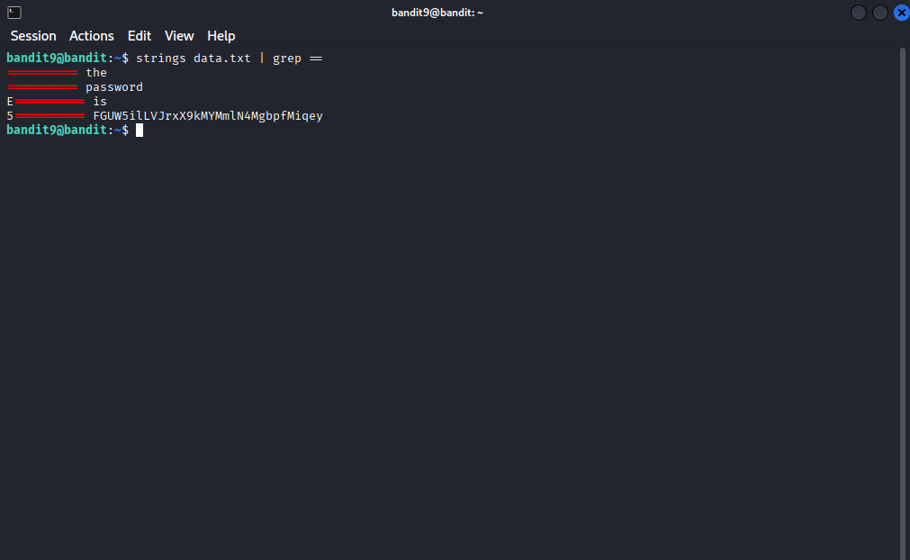

## Level 10

```shell
base64 -d data.txt # Koristimo komandu base64 sa opcijom -d da bismo izvršili dekodiranje sadržaja datoteke data.txt, jer je fajl zapisan u Base64 formatu.
```

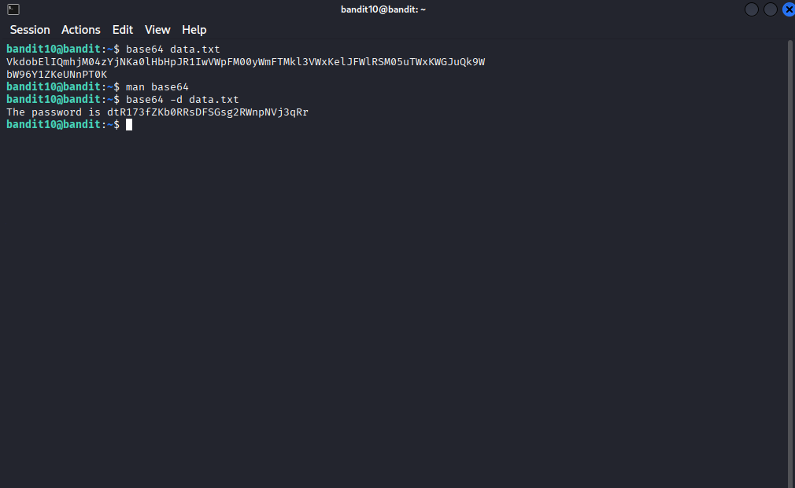


